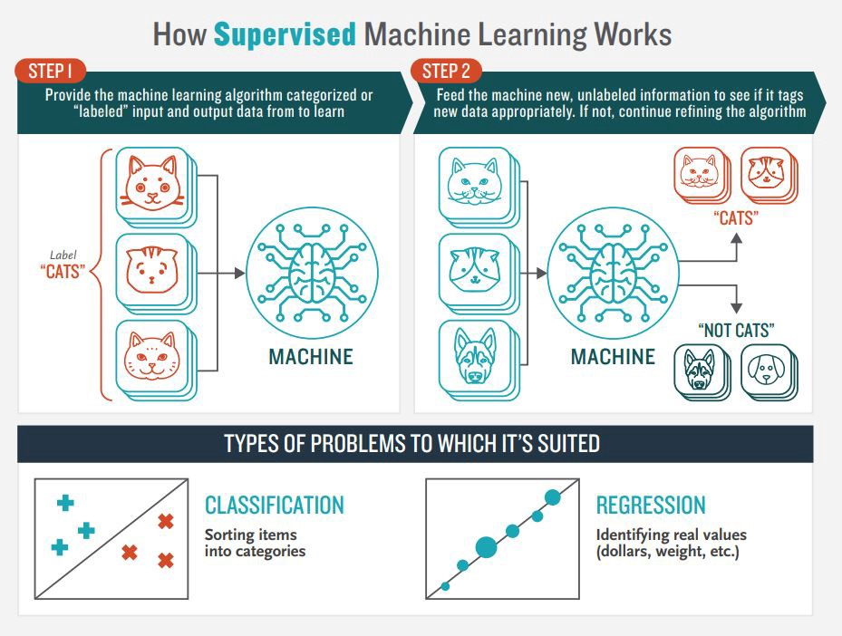
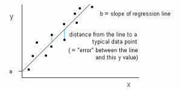
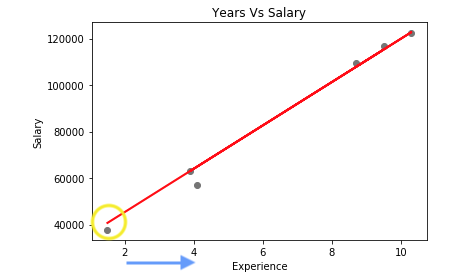
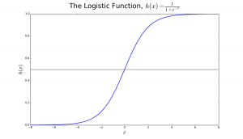
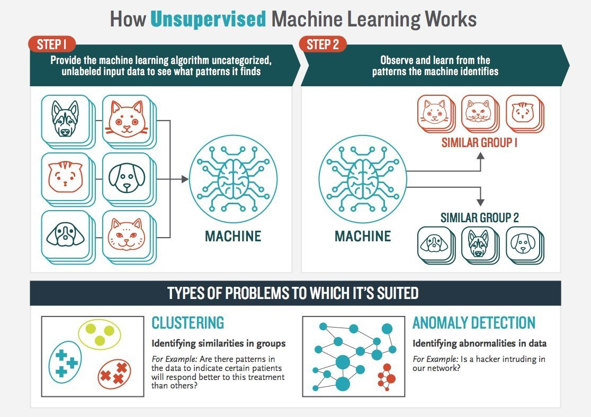
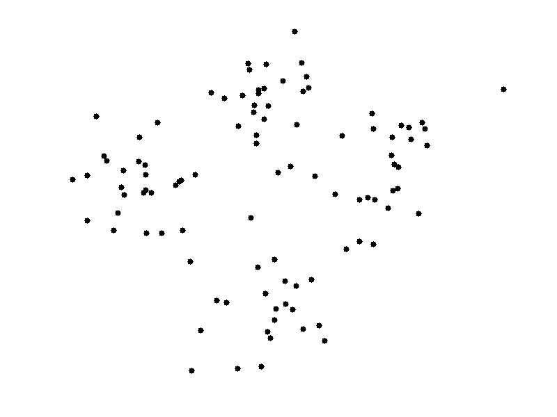
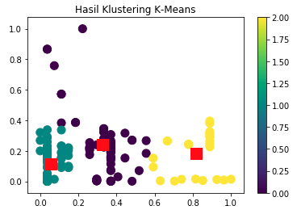

# Macam Algoritma Machine Learning

Seperti yang sudah kita bahas pada tipe *machine learning* sebelumnya, ada dua kategori *machine learning*. Pertama, *supervised* dan yang ke dua *unsupervised*. Sekarang, kita akan bahas masing-masing algoritma yang paling terkenal berdasarkan kategorinya.

## Supervised Algoritma

*Supervised* memiliki ***training data* (`x`)** dan **target *value* (`Y`)** seperti apa yang diinginkan. Algoritma tersebut seolah-olah dilatih terlebih dahulu agar dapat melakukan prediksi maupun klasifikasi. Sekarang kita bagi lagi *supervised* menjadi dua bagian:

1. *Regression*

    Digunakan ketika target *value output*-nya (`Y`) adalah **riil *value***.

    > Bilangan riil atau bilangan *real* adalah sistem **bilangan yang dapat ditulis dalam bentuk desimal**. Angka desimal adalah **angka berbasis 10 yang dibentuk dari angka 0, 1, 2, 3, 4, 5, 6, 7, 8, 9.**

    Selama *output*-nya berupa satuan angka, biasanya menggunakan *regression*.

    Contoh: Memprediksi berat badan, memprediksi tinggi badan, memprediksi curah hujan, dll.

2. *Classification*

    Digunakan ketika target *value*-nya (`Y`) adalah untuk **mengkategorikan sesuatu**. Bisa dikatakan, selama *output*-nya untuk mengkategorikan sesuatu, yang digunakan adalah *classification*. Dalam *classification* juga biasanya jawabannya hanya dua, bisa **iya** atau **tidak**.

    Contoh: Mengetahui seseorang sakit atau tidak, mengetahui limbah tercemar atau tidak, mengetahui warna langit biru atau merah, dll.



4 algoritma *supervised:*

1. Regresi Linier Sederhana

    Di *machine learning*, kita mempunyai inputan data atau variabel (`x`), yang kita gunakan untuk mencari *output* (`Y`). Ada hubungan antara *input* variabel dengan *output*. ***Goal* dari ML *(Machine Learning)* adalah mengukur seberapa besar hubungan tersebut**.

    Regresi linier direpresentasikan sebagai garis melintang (`a`) di dalam gambar:

    

    Gambar di atas menunjukkan letak titik-titik perpotongan nilai `x` dan `Y` (`b`) di dalam himpunan data. **Tujuan regresi linier adalah mencari garis yang paling dekat dengan sebagian besar titik-titik nilai tersebut**. Regresi linier akan mengurangi jarak *(error)* antara garis `a` dengan nilai `Y`.

    Di regresi linier, hubungan antara variabel *input* dan variabel *output* dinyatakan dalam bentuk persamaan:

    ```py
    y = a + bx
    ```

    Di mana:
    - `y` adalah variabel yang dipengaruhi (variabel tidak bebas atau variabel dependen)
    - `x` adalah variabel yang mempengaruhi (variabel bebas atau variabel independen)
    - `a` adalah perpotongan garis (intersep atau nilai `y` apabila `x = 0`)
    - `b` adalah kemiringan garis

    **Contoh:**

    Dikarenakan **regresi** merupakan salah satu teknik untuk **meprediksi data di masa yang akan datang**, lebih mudahnya mari kita lihat kasus di mana **perusahaan mendata pegawainya berdasarkan berapa lama mereka bekerja dan berapa besar gaji mereka saat ini**.

    **YearsExperience**|**Salary**
    :-----|:-----
    1.1|39343.00
    1.3|46205.00
    1.5|37731.00
    2.0|43525.00
    2.2|39891.00
    2.9|56642.00
    3.0|60150.00
    3.2|54445.00
    3.2|64445.00
    3.7|57189.00
    3.9|63218.00
    4.0|55794.00
    4.0|56957.00
    4.1|57081.00
    4.5|61111.00
    4.9|67938.00
    5.1|66029.00
    5.3|83088.00
    5.9|81363.00
    6.0|93940.00
    6.8|91738.00
    7.1|98273.00
    7.9|101302.00
    8.2|113812.00
    8.7|109431.00
    9.0|105582.00
    9.5|116969.00
    9.6|112635.00
    10.3|122391.00
    10.5|121872.00

    Tabel di atas terdiri dari 2 kolom, yaitu ***YearsExperience*** dan ***Salary*** *(Dollar)*, di mana data diurutkan dari tahun bekerja paling kecil ke yang paling besar. Kita bisa lihat bahwa, **semakin lama seseorang bekerja kecenderungannya semakin tinggi pula gajinya**.

    Namun ada ketentuan lain bahwa, **terkadang tahun bekerja yang lama tidak selalu bergaji lebih besar dari pegawai yang bekerja lebih singkat**. Misal kita amati ada pekerja yang bekerja selama 3.9 tahun bergaji 63K *dollar*, sementara yang lainnya bekerja selama 4.5 tahun bergaji 61K.

    Maka muncul sebuah pertanyaan, **apakah memang hubungan antara lama bekerja dengan besarnya gaji adalah linier?** Jika iya, seberapa kuat kelinieritasannya?

    > **Linier adalah keadaan di mana pertumbuhan selaras dengan lama sesuatu dikerjakan**. Jika digambarkan dengan grafik, linier berbentuk garis miring sempurna dari kecil ke besar.

    Regresi melalui salah satu tekniknya yaitu regresi linier sederhana menjawab pertanyaan di atas. Regresi linier **mencari hubungan** antara 1 variabel yang dipengaruhi *(`y` = Salary)* dengan 1 variabel yang mempengaruhi *(`x` = YearsExperience)*.

    Jika susah memahami linier regresi dalam bentuk rumus, bentuk grafik ini mungkin bisa memudahkan teman-teman untuk memahaminya.

    

    Penjelasannya sebagai berikut:

    - **Titik abu-abu** adalah distribusi atau **penyebaran data asli hasil observasi para karyawan yang mendapatkan gaji dengan jumlah sekian terhadap sekian lama waktu kerja**.
    - Dengan menggunakan rumus yang sudah kita ketahui di atas, maka
    rumus: `y = a + bx`
    dalam kasus ini akan menjadi:
    `Salary = a + b * YearsExperience`
    - **Konstanta `a` (dilingkari kuning)** adalah nilai yang pertama muncul pada y-axis *(Salary)*. Ambil contoh nilai awalnya adalah $40k, maka `a` = 40k. Atau dalam kasus ini berarti bisa dibaca: **Karyawan dengan 0 (nol) tahun lama kerja akan mendapat gaji $40k**.
    - **Koefisien `b` (panah warna biru)** adalah proyeksi rentang nilai pada perubahan nilai di x-axis *(YearsExperience)* terhadap y-axis. Gampangnya bisa dikatakan begini: **Asumsikan bahwa setiap kenaikan +2 tahun lama kerja, karyawan akan mendapat kenaikan +$20k gaji.**
    - **Garis merah menyerong** adalah ***best fitting line*** dari distribusi yang ada.

1. Regresi Logistik Sederhana

    Jika regresi linier digunakan untuk *regression*, maka **regresi logistik digunakan untuk *classification***.

    Kita bisa memprediksi suatu kejadian terjadi atau tidak terjadi, karena ada 2 kemungkinan saja. **Jika terjadi kita ibaratkan 1, jika tidak terjadi kita ibaratkan 0.** Jadi, **jika kita ingin memprediksi pasien sakit, kita bisa menandai pasien tersebut dengan angka `1`.**

    

    Pada gambar di atas, kita bisa lihat **grafik dari regresi logistik biasanya berbentuk seperti huruf S**.

    **Contoh:**

    Kita mempunyai variabel `Y` untuk menentukan tumor ganas atau tidak, variabel `Y` tersebut bernilai `1` jika tumornya ganas. Sedangkan variabel `x` kita gunakan untuk mengukur keganasan tumor tersebut berdasarkan ukuran si tumor.

    **Regresi logistik merubah nilai `x` (dari setiap variabel `x`) ke rentang angka `0` sampai dengan `1`**. Dengan ketentuan, **jika probabilitasnya menyentuh angka >= `0.5` dari variabel `Y`, maka tumor diasumsikan akan menjadi ganas.**

1. *Naive Bayes*

    ***Naive bayes* merupakan pengklasifikasian dengan metode probabilitas (kemungkinan-kemungkinan) dan statistik** yang dikemukakan oleh ilmuwan Inggris Thomas Bayes, yaitu **memprediksi peluang di masa depan berdasarkan pengalaman di masa sebelumnya**.

    Berikut adalah persamaan dari *naive bayes*:

    ```py
    P(h|x) = (P(x|h) . P(h)) / P(x)
    ```

    Dimana:
    - `x` adalah data dengan *class* yang belum diketahui
    - `h` adalah hipotesis data (merupakan suatu *class* spesifik)
    - `P(h|x)` adalah probabilitas hipotesis `h` berdasar kondisi `x` *(posteriori probabilitas)*
    - `P(x|h)` adalah probabilitas `x` berdasarkan kondisi pada hipotesis `h`
    - `P(H)` adalah probabilitas hipotesis `h` *(prior probabilitas)*
    - `P(X)` adalah probabilitas `x`

    **Contoh:**

    Ada sebuah tabel dengan isian sebagai berikut:

    |  | Weather     | Play    |
    |---------|----------|-----|
    | 1       | Sunny    | No  |
    | 2       | Overcast | Yes |
    | 3       | Rainy    | Yes |
    | 4       | Sunny    | Yes |
    | 5       | Sunny    | Yes |
    | 6       | Overcast | Yes |
    | 7       | Rainy    | No  |
    | 8       | Rainy    | No  |
    | 9       | Sunny    | Yes |
    | 10      | Rainy    | Yes |
    | 11      | Sunny    | No  |
    | 12      | Overcast | Yes |
    | 13      | Overcast | Yes |
    | 14      | Rainy    | No  |

    Berdasarkan tabel di atas, kita bisa **memprediksi status *play* berdasarkan variabel *weather***. Pertanyaanya, apa (status *play*) yang akan terjadi jika *weather* = *sunny?*

    Untuk menentukan hasil *yes* atau *no* (karena *value* dari *play* hanya *yes* atau *no*) berdasarkan variabel *weather* = *sunny*, **hitung `P(yes|sunny)` dan `P(no|sunny)` lalu pilih hasil perhitungan probabilitas yang paling besar.**

    Hitung `P(yes|sunny)`:

    ```py
    (P(sunny|yes) * P(yes)) / P(sunny) = ?
    (3/9 * 9/14 ) / (5/14) = 0.60
    ```

    Berdasarkan model di atas, terdapat:
    - 3 ***weather sunny*** dengan ***play yes*** dan 9 ***play yes***
    - 9 ***play yes*** dan 14 **baris data**
    - 5 ***weather sunny*** dan 14 **baris data**

    Hitung `P(no|sunny)`:

    ```py
    (P(sunny|no) * P(no)) / P(sunny) = ?
    (2/5 * 5/14 ) / (5/14) = 0.40
    ```

    Berdasarkan model di atas, terdapat:
    - 2 ***weather sunny*** dengan ***play no*** dan 5 ***play no***
    - 5 ***play no*** dan 14 **baris data**
    - 5 ***weather sunny*** dan 14 **baris data**

    Hasil perhitungan `P(yes|sunny) = 0.60`

    Hasil perhitungan `P(no|sunny) = 0.40`

    Dengan hasil perhitungan di atas, di mana probabilitas `P(yes|sunny)` lebih besar dari `P(no|sunny)`, dapat disimpulkan jika ***weather* = *sunny*, maka *play* = *yes***.

## Unsupervised Algoritma

*Unsupervised* **tidak memiliki target variabel yang diharapkan**, tapi *unsupervised* lebih fokus ke pengelompokkan objek yang hampir sama dalam suatu area tertentu. Sekarang kita bagi lagi *unsupervised* menjadi dua bagian:

1. *Clustering*

    Digunakan untuk **mengelompokkan sampel** sedemikian rupa. Sehingga, **objek dalam *cluster* *(group)* yang sama, lebih mirip satu sama lain dari pada objek dari *cluster* lain**.

    Contoh: Pengelompokan pembeli berdasarkan kebiasaan barang yang dibeli.

1. *Association*

    Digunakan untuk **menemukan probabilitas kemunculan suatu item baru berdasarkan item yang lain**. Ini banyak digunakan *e-commerce* yang menggunakan keranjang belanja untuk pembayarannya.

    Contoh: Ketika orang membeli barang A, mereka cenderung membeli barang B, artinya jika orang membeli roti, 80\% kemungkinan orang itu akan membeli telur juga, dll.



1 algoritma *unsupervised:*

1. *K-means Clustering*

    ***K-means clustering*** adalah salah satu *“unsupervised machine learning algorithms”* yang paling sederhana dan populer. **Tujuan dari algoritma ini adalah untuk "menemukan grup *(cluster)*" dalam data, dengan jumlah grup yang diwakili oleh variabel K**. Variabel K sendiri adalah jumlah *cluster* yang kita inginkan.

    *K-means* melakukan dua hal penting, yaitu:

    - **Menghitung *centroid* (rata-rata) dari K *cluster***.
    - **Memisahkan masing-masing data yang mirip ke dalam masing-masing *cluster***.

    Hasil dari *k-mean clustering* adalah:

    1. ***Centroid* dari *cluster* K**, yang dapat digunakan dan diberikan label data baru
    2. Data baru yang sudah dilabeli, bisa untuk *data training* (setiap titik data ditugaskan ke satu *clusters*)

    Alur algoritma *k-means* adalah sebagai berikut:

    

    Berdasarkan *flowchart* di atas, kita memiliki *input* dan 3 buah proses.

    1. Proses menghitung *centroid*.

    2. Menghitung data yang akan dikelompokkan dengan *centroid*.

    3. Mengelompokkan data berdasarkan jarak terdekat *(minimum distance)*.

    Dan kita membuat perulangan untuk mengecek kondisi **"apakah posisi *centroid* tetap dan tidak ada perubahan terhadap datanya?"**.

    Apabila **ya** maka selesai melakukan pengelompokkan. Tapi apabila **masih ada perubahan centroid maka kita *update* dan hitung kembali nilai *centroid***.

    Jika susah memahami *k-means clustering* dalam bentuk *flowchart*, bentuk animasi dan grafik ini mungkin bisa memudahkan teman-teman untuk memahaminya.

    Animasi proses pengelompokan data:

    

    Sebagai contoh, Kita akan menunjukkan cara kerja algoritma *k-means* dengan dataset sampel dari data *driver* pada aplikasi Go-Track. Kita hanya akan **menggunakan dua fitur *driver*** pada aplikasi Go-Tracks untuk dijadikan variabel, yaitu

    1. **Jarak rata-rata** yang di tempuh *driver* per hari
    2. **Kecepatan** *driver* dalam mengemudi per hari

    Hasil pemrosesan *k-means* menghasilkan grafiknya seperti ini:

    

    Penjelasannya sebagai berikut:

    - **3 kotak yang berwarna merah** adalah *centroid* atau rata-rata dari data yang ada.
    - **Data dibagi menjadi 3 *cluster*,** berdasarkan jarak terdekat dari *centroid*, data yang berwarna **hijau**, data yang berwarna **ungu**, dan data yang berwarna **kuning**.
